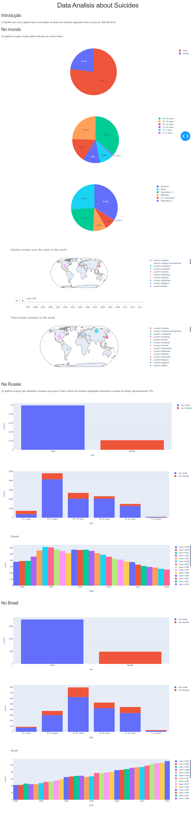

# Suicide rate from 1985 up to 2016 in the world

## Dataset
The dataset can be found in the site https://www.kaggle.com/russellyates88/suicide-rates-overview-1985-to-2016

## Purpose
The purpose of this work is show visually how suicide rates behave throughout the years and how this rates relate to data such as sex, age, generation, etcetera.

## Video
https://www.youtube.com/watch?v=OoGLqI21lig

## Graphics
</img>
